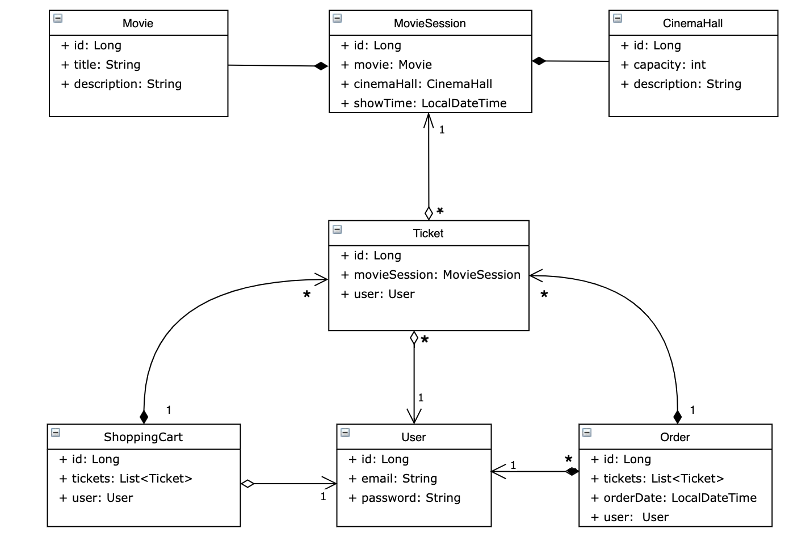

# Cinema-App

-------------------------------------------------------------

The purpose of this project is to create a web application for a cinema that enables users to browse through the schedule of movie sessions and purchase tickets online. 
The application is equipped with a user registration system and a secure section with different access rights, depending on user roles. 
Users can also retrieve details about the movies that are available at the cinema, including descriptions.

-------------------------------------------------------------
# Features
* Authentication
* Authorization:
  * User, who has `ADMIN`role:
    * Create and delete movie
    * Create and delete movie sessions
    * Create and delete cinema halls
  * User, who has `USER` role: 
    * Check available movie sessions
    * Check available movies and their descriprions
    * Check available cinema halls
* Registation of new user (shoping cart adds automaticaly)
* Adding tickets to a shopping cart
* Completing order
 --------------------------------------------------------   

# How to run application?

1. Clone this project to your local machine
2. Create empty schema in your db
3. Replace variables 
`YOUR_DB_DRIVER`,
`YOUR_URL_TO_DB`,
`YOUR_USERNAME`,
`YOUR_PASSWORD` in **src/main/resources/db.properties** to yours
4. Deploy generated WAR file to a servlet container such as Tomcat
5. Login in existing accounts : `admin@.ua` with password `1234` with Admin permitions
or register your own user account using `**/register `endpoint

----------------------------------

# Structure

* controller
  * Registration (POST) - `/register` - register a new user
  * Login (POST) - `/login` - authentication
  * Logout (GET) - `/logout` - invalidate session
  * Cinema halls:
    * Add cinema-hall (POST) - `/cinema-halls/` 
    * Check cinema-hall (GET) - `/cinema-halls/`
  * Movie:
    * Add movie (POST) - `/movies/`
    * Check movies (GET) - `/movies/`
  * Movie Sessions:
     * Show available movie sessions (GET) - `/movie-sessions/available/`
     * Add a new movie session (POST) - `/movie-sessions/` 
     * Update movie session by ID (PUT) - `/movie-sessions/${id}/` 
     * Delete movie session by ID (DELETE) - `/movie-sessions/${id}`
  * Order:
    * Show orders history (GET) - `/orders`
    * Complete order (POST) - `/orders/complete`
  * Shopping cart:
    * Show all tickets added to user's shopping cart (GET) - `/shopping-carts/by-user/`
    * Update shopping cart by movie session ID (PUT) - `/shopping-carts/movie-sessions/`
  * User:
    * Show user's information by email (GET) - `/users/by-email/`
* dao - classes in this package are used for retrieving and sending data to db
* service - classes in this package are made for bussines - logic realization
* dto - wrapper for model objects to unify the requests and responses in controllers
* exception - custom exception class used for throwing exceptions in DAO`s
* lib - custom annotations used for validation
* model - POJO`s that represent data
* util - class used for DateTime pattern
* resources - here you can store non-java files(etc. used for setting db)

----------------------------------------
Model structure:

---------------------------------

# Used Technologies

* Java **`v.17.0.5`**
* MySQL **`v.8.0.33`**
* Spring **`v.5.3.20`**
* Spring security **`v.5.6.18`**
* Hibernate **`5.6.14.Final`**
* Maven **`v.3.8.6`**
* Tomcat **`v.9.0.73`**
* Javax Servlets **`v.4.0.1`**
* Javax Annotations **`v.1.3.2`**

--------------------------------
# Made by Leshtaiev Olexandr